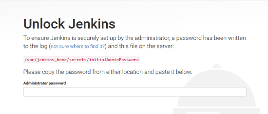

## Operability Take Home Exercise 
##### Erich EJ Best – 201-218-9860
ej.best@outlook.com

##### Here is what is completed
- Setup a Vagrant configuration for deployment of Virtual Machine
- The Virtual Machine will have a Jenkins Server for Continuous Integration
- Vagrant will call an Ansible Playbook and will tailor the Jenkins Server 

How this was tested
- Tested with Kali Linux 2023.1 with privileged account
- Tested on Windows 11 with privileged account

Following software is required 
1.	Hashicorp Vagrant
2.	Oracle Virtual Box  
3.	Red Hat Ansible 

Unzip vagrant-virtualbox-ansible-jenkins.zip 
&nbsp;&nbsp;&nbsp; Files included  
&nbsp;&nbsp;&nbsp;&nbsp;&nbsp;&nbsp;&nbsp;&nbsp; a.	Vagrantfile  
&nbsp;&nbsp;&nbsp;&nbsp;&nbsp;&nbsp;&nbsp;&nbsp; b.	playbook.yml 
&nbsp;&nbsp;&nbsp;&nbsp;&nbsp;&nbsp;&nbsp;&nbsp; c.	readme.docx  

Setup with the following steps
<pre> cd vagrant-virtualbox-ansible-jenkins </pre>
Startup Vagrant 
<pre>vagrant up</pre>
Connect to the Virtual Machine
<pre>vagrant ssh</pre>
Get privileges
<pre>sudo su -</pre>
List this file with the password 
<pre> cat /var/lib/jenkins/secrets/initialAdminPassword</pre>
You can see the password and use copy/paste the password for the next step

In a browser see Jenkins  
Navigate to http://localhost:8080 and Jenkins should be starting up 
The initial Jenkins Screen will be waiting for this password.
